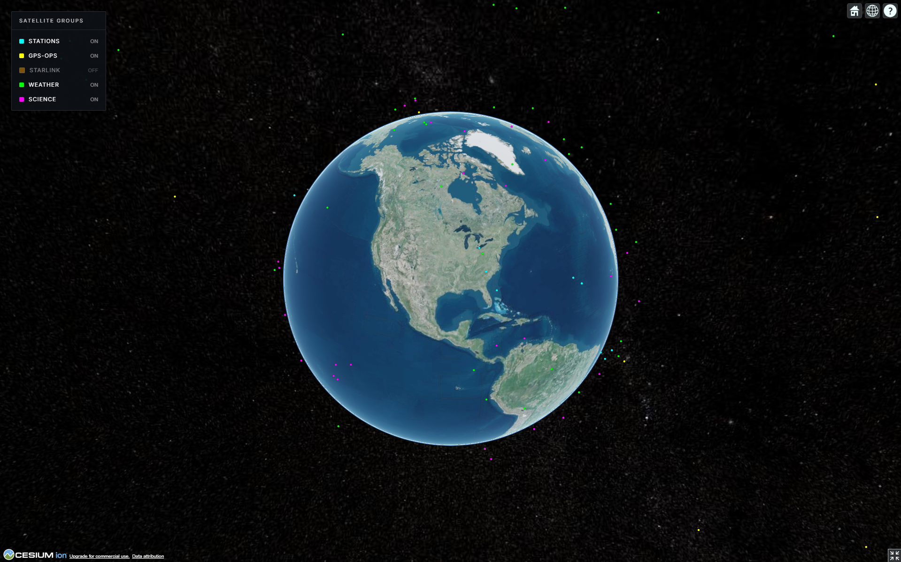
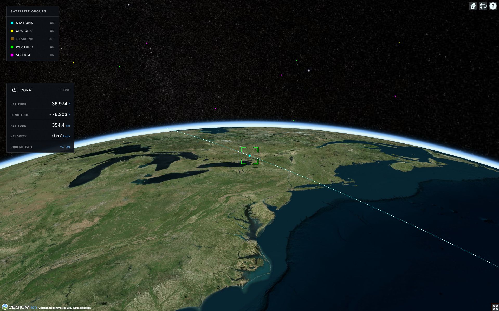

<div align="center">

<h1>Satellite Tracker</h1>

<p>Tracks satellite constellations in real time on a 3D Cesium globe.<br>
Orbital positions are computed by a custom SGP4/SDP4 engine written in C++17 and compiled to WebAssembly.</p>

[](https://react.dev)
[](https://vitejs.dev)
[](https://cesium.com)
[](https://emscripten.org)
[](https://fastapi.tiangolo.com)
[](https://vercel.com)

<br>

<a href="https://satellite-tracker-gilt.vercel.app/"></a>

</div>

<br>

<table>
  <tr>
    <td></td>
    <td></td>
  </tr>
</table>

---

## Table of Contents

- [Why](#why)
- [Features](#features)
- [Stack](#stack)
- [Prerequisites](#prerequisites)
- [Setup](#setup)
- [Running Locally](#running-locally)
- [How the Propagator Works](#how-the-propagator-works)
- [Project Structure](#project-structure)
- [Satellite Groups](#satellite-groups)
- [Deployment](#deployment)
- [Known Limitations](#known-limitations)

---

## Why

Most browser-based satellite trackers delegate orbital math to [satellite.js](https://github.com/shashwatak/satellite-js), a JavaScript port of a 1980s Fortran implementation. This project replaces it with a C++17 SGP4/SDP4 implementation (Vallado 2006) compiled to WebAssembly via Emscripten.

Key technical decisions:

- **Batch propagation on pre-allocated heap buffers.** One call to `propagateBatch` per frame covers the full constellation. Zero per-satellite JS overhead, zero GC pressure on the hot path.
- **Glitch-free camera tracking.** Cesium's `trackedEntity` triggers an internal reference-frame mode switch that causes a visible stutter on first selection. A `preRender` listener using `camera.lookAt` sidesteps this entirely.
- **Antimeridian-correct orbital tracks.** Ground track polylines split at the dateline so they render correctly without crossing artifacts.

---

## Features

- GPS, weather, science, and space station constellations with per-group color coding and toggles
- Live TLE data fetched directly from [CelesTrak](https://celestrak.org)
- Click any satellite to open a draggable stats panel: lat, lon, altitude, speed at 1 Hz
- Camera flyTo with per-satellite lock-on tracking
- Orbital ground track toggle (2 full orbital periods, 10s step resolution)
- FastAPI backend as a TLE proxy fallback

---

## Stack

| Layer | Tech |
|---|---|
| Globe | CesiumJS 1.142, Resium |
| Frontend | React 19, Vite 8 |
| Propagation | C++17 compiled to WASM via Emscripten 6.0 |
| TLE data | CelesTrak (direct browser fetch) |
| Backend | Python 3, FastAPI |

---

## Prerequisites

- Node.js 18+
- Python 3.11+
- A free [Cesium Ion](https://cesium.com/ion/) access token
- Emscripten SDK (only required to rebuild the C++ propagator)

<details>
<summary><strong>Install Emscripten (Windows)</strong></summary>

```powershell
git clone https://github.com/emscripten-core/emsdk.git C:\emsdk
cd C:\emsdk
.\emsdk install latest
.\emsdk activate latest
```

</details>

<details>
<summary><strong>Install Emscripten (Mac / Linux)</strong></summary>

```bash
git clone https://github.com/emscripten-core/emsdk.git ~/emsdk
cd ~/emsdk
./emsdk install latest
./emsdk activate latest
```

</details>

---

## Setup

```bash
# Clone
git clone https://github.com/your-username/satellite-tracker.git
cd satellite-tracker

# Backend
cd backend
python -m venv venv
source venv/bin/activate      # Windows: .\venv\Scripts\activate
pip install -r requirements.txt
cd ..

# Frontend
cd frontend && npm install && cd ..

# Cesium Ion token
echo "VITE_CESIUM_ION_TOKEN=your_token_here" > frontend/.env
```

> `sgp4.js` and `sgp4.wasm` are committed to the repo. No build step needed unless you modify `cpp/`.

<details>
<summary><strong>Rebuilding the WASM propagator</strong></summary>

**Windows:**
```powershell
& "C:\emsdk\emsdk_env.ps1"
powershell -File cpp/build.ps1
```

**Mac / Linux:**
```bash
source ~/emsdk/emsdk_env.sh
bash cpp/build.sh
```

Output lands in `frontend/public/`. Commit the updated files when done.

</details>

---

## Running Locally

```bash
# Terminal 1 - backend
cd backend && uvicorn main:app --reload

# Terminal 2 - frontend
cd frontend && npm run dev
```

Open [http://localhost:5173](http://localhost:5173).

---

## How the Propagator Works

Each TLE is parsed once by `twoline2satrec` (C++) into an `elsetrec` struct. `sgp4init` pre-computes all frame-invariant secular coefficients so per-frame work is mostly arithmetic plus a single Newton-Raphson solve for Kepler's equation.

On every animation frame (~16 ms):

```
JS    propagateBatch(handlesPtr, count, outPtr, timestampMs)
         |
WASM  for each handle:
         sgp4(rec, tsince)          // ECI position, km
         eciToGeodetic(pos, gmst)  // WGS-84 lat/lon/alt via Bowring's method
         write [lat, lon, alt_m, speed, valid] to outPtr
         |
JS    new Float64Array(mod.HEAPF64.buffer, outPtr, count * 5)
```

The output buffer view is recreated each frame because `ALLOW_MEMORY_GROWTH` can relocate the WASM heap. The handles buffer is stable and only reallocated when the active satellite groups change.

---

## Project Structure

```
satellite-tracker/
├── cpp/
│   ├── sgp4.h           # elsetrec, PropResult, Geodetic
│   ├── sgp4.cpp         # SGP4/SDP4 implementation (Vallado 2006)
│   ├── bindings.cpp     # Emscripten embind + satrec handle registry
│   ├── build.ps1        # Windows build
│   └── build.sh         # Mac/Linux build
├── frontend/
│   ├── public/
│   │   ├── sgp4.js      # WASM JS loader (committed build artifact)
│   │   └── sgp4.wasm    # WASM binary   (committed build artifact)
│   └── src/
│       ├── components/
│       │   ├── Globe.jsx          # Globe, rendering, camera, ground tracks
│       │   ├── StatsPanel.jsx     # Draggable satellite stats panel
│       │   └── GroupSelector.jsx  # Group toggle sidebar
│       ├── wasm/
│       │   └── propagator.js      # WASM module loader + JS API
│       └── api/
│           └── client.js          # CelesTrak fetch + TLE parser
└── backend/
    └── main.py          # FastAPI TLE proxy
```

---

## Satellite Groups

| Group | CelesTrak key | Typical count |
|---|---|---|
| Space Stations | `stations` | ~20 |
| GPS | `gps-ops` | ~30 |
| Weather | `weather` | ~20 |
| Science | `science` | ~60 |
| Starlink | `starlink` | 5,000+ |

Starlink is available in the group selector but off by default. Loading 5,000+ satellites affects frame rate on lower-end hardware.

---

## Deployment

### Vercel (frontend)

`sgp4.js` and `sgp4.wasm` are committed to the repo. Vite copies everything in `public/` to `dist/` at build time, so no Emscripten step is needed on Vercel.

1. Import the repo in Vercel
2. In **Project Settings > General**, set **Root Directory** to `frontend`
3. Vercel auto-detects Vite; leave build command and output directory at their defaults
4. Add the environment variable:
   ```
   VITE_CESIUM_ION_TOKEN = <your token>
   ```
5. Deploy

When you update the C++ source: rebuild locally, commit the updated `sgp4.js` and `sgp4.wasm`, and push. Vercel redeploys on the next push automatically.

### Render (backend)

`render.yaml` is at the repo root. Connect the repo in Render and it picks up the config automatically.

Set `ALLOWED_ORIGINS` in the Render dashboard to your Vercel deployment URL.

> The frontend fetches TLEs directly from CelesTrak. The backend is a proxy fallback and not in the critical path for normal use.

---

## Known Limitations

- Deep-space satellites (period >= 225 min) use secular-only perturbations. Full SDP4 lunar/solar resonance is not implemented, so positions drift on multi-day propagations. Accurate enough for real-time display.
- No auth on the backend. Add a reverse proxy before exposing it publicly.
- TLEs are fetched on demand and not persisted between sessions. Position accuracy degrades for TLEs older than a few days.
